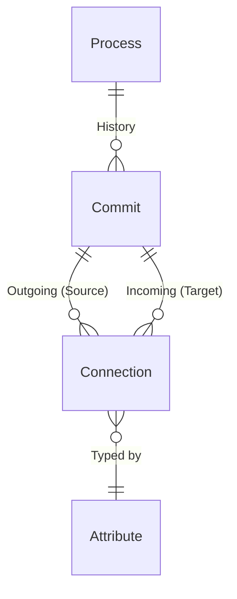

# Universal Process Graph (UPG) Architecture

Ce document décrit l'architecture du cœur du moteur de modélisation (ERP/MES/PLM). Cette architecture "Graph-Relational" est conçue pour représenter n'importe quel processus industriel (flux de matière ou d'information) via une approche unifiée et fractale.

## 1. Philosophie : Le Jumeau Numérique Fractal

L'architecture repose sur l'unification des concepts : Machines, Articles, Commandes et Factures sont tous modélisés par la même brique fondamentale.

- **Tout est un Process :** Le conteneur d'identité stable dans le temps.
- **Tout est Historisé :** L'état actuel est la somme des événements passés (**Commits**).
- **Tout est Connecté :** Les objets interagissent via un graphe sémantique typé par des **Attributs**.

### Architecture Hybride

1.  **Structure (SQL Relationnel) :** Le graphe des relations (`Connection`) est typé et indexé pour des traversées rapides.
2.  **Donnée (NoSQL JSON) :** Les valeurs scalaires (mesures, configs) sont stockées en JSON pour la performance d'écriture.
3.  **Sémantique (Dictionnaire Global) :** Toutes les clés sont centralisées dans `Attribute` pour garantir l'intégrité du langage métier.

---

## 2. Modèle de Données

### A. Process (L'Identité)

Le conteneur persistant. Il représente l'entité dans le monde réel.

Exemples : "Machine de Découpe Laser A", "Commande #12345", "Opérateur Jean".

### B. Attribute (Le Dictionnaire)

Le dictionnaire global des termes utilisables dans l'usine.

- `key` (@id) : Identifiant unique sémantique (ex: elec.voltage, part.engine_left).
- `type` : Définit le comportement du moteur de calcul (Scalaire vs Relationnel).

### C. Commit (L'Événement & L'État)
Représente une modification de l'état du Process à un instant T. Il est immuable.

- `changes` (JSON) : Le Delta des valeurs scalaires (ex: { "rpm": 1500 }).
- `snapshot` (JSON, Nullable) : Le cache de l'état calculé.
- `outgoing` / `incoming` : Les arêtes du graphe partant ou arrivant à ce commit.

### D. Connection (Le Graphe)

Remplace les clés étrangères rigides. C'est une table de liaison dynamique.

- `attributeKey` : Définit la nature de la relation.

Permet de modéliser des arbres (Hiérarchie), des flux (Dépendance de données) ou des références (Localisation).

## 3. Sémantique & Moteur de Fusion

L'intelligence du système repose sur l'enum AttributeType. C'est lui qui dicte comment reconstruire l'état d'un objet lors de la lecture.

### Les Types Scalaires (Stockés dans Commit.changes)

- `LENGTH`, `MASS`, `TIME`, `TEMPERATURE`... : Grandeurs physiques (permettent les conversions auto).
- `TEXT`, `BOOLEAN`, `CUSTOM` : Données métier simples.

### Les Types Structurels (Stockés dans Connection)

C'est ici que se joue la distinction critique pour l'agrégation de données :

1. `DEPENDENCY` (Fusion / Composition)

- Sémantique : "Je suis composé de X" ou "Je consomme les données de X".
- Comportement : Le moteur fusionne le snapshot de la cible dans le snapshot du parent, en le préfixant avec la clé de l'attribut.
- Exemple : Une Voiture connectée à un Moteur via l'attribut part.engine_left.
  - Snapshot Moteur : { "rpm": 1000 }
  - Snapshot Voiture (Résultat) : { "part.engine_left.rpm": 1000, ... }

2. `REFERENCE` (Lien Faible / Pointeur)

- Sémantique : "Je pointe vers X", "Je suis situé à X".
- Comportement : Le moteur stocke uniquement l'ID de la cible. Pas de fusion.
- Exemple : Une Palette située dans un Entrepôt via l'attribut sys.location.
  - Snapshot Palette (Résultat) : { "sys.location": "cuid_entrepot_A" }.

## 4. Guide d'Implémentation

### Lecture (Reconstruction de l'État)

Algorithme pour obtenir l'état courant d'un Process :

1. Récupérer le dernier Commit.
2. Si snapshot existe -> Retourner le JSON.
3. Sinon (Calcul Lazy) :

- Initialiser State = commit.changes.
- Charger les connexions sortantes (outgoing) avec leur Attribute.
- Pour chaque connexion de type DEPENDENCY :
  - Récupérer le snapshot de l'enfant.
  - Fusionner : State[connection.attributeKey + "." + childKey] = childValue.
- Pour chaque connexion de type REFERENCE :
  - Stocker l'ID : State[connection.attributeKey] = connection.toId.
- (Optionnel) Sauvegarder State dans Commit.snapshot.
